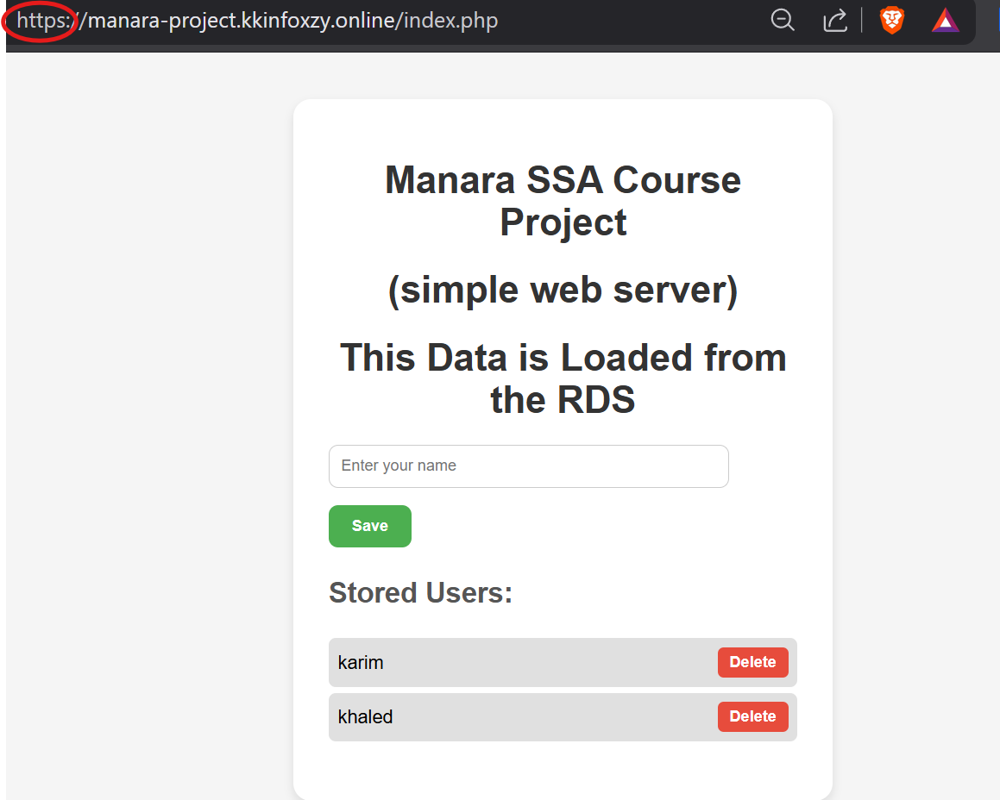
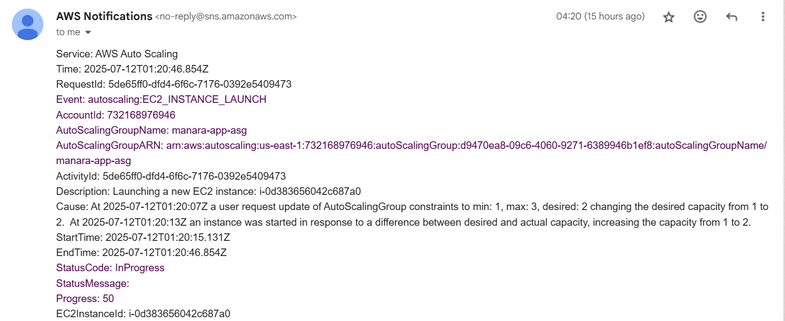
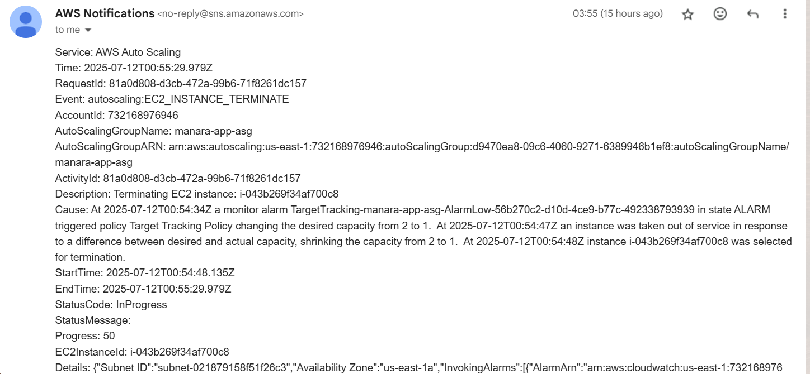

# 🚀 AWS Scalable Web App


This project is a fully scalable web application hosted on AWS infrastructure using **EC2 Auto Scaling**, **Application Load Balancer (ALB)**, **RDS (MySQL)**, **ACM (SSL)**, and a custom domain integrated with **GoDaddy DNS**.

---

## 📸 Architecture Diagram


---

## 🧠 Project Overview

A basic PHP-based web app that:

- Allows users to submit their name via a form
- Stores the submitted names in an **Amazon RDS MySQL** database
- Displays all stored names dynamically from the database
- Is accessible securely via **HTTPS** using a custom domain

---

## 📐 Architecture Components

- **GoDaddy Domain**: For DNS management
- **ACM (AWS Certificate Manager)**: For free SSL certificate
- **ALB (Application Load Balancer)**: For handling HTTP/HTTPS traffic
- **Auto Scaling Group (EC2)**: Automatically scales based on CPU usage
- **Public/Private Subnets across multiple AZs**: For high availability and isolation
- **RDS (MySQL)**: Managed database for storing user data
- **Security Groups**: For controlled inbound/outbound traffic
- **SNS + CloudWatch** for monitoring and notifications

---

## 🌍 Live Demo

Check out the running version of this app here:  
🔗 [https://manara-project.kkinfoxzy.online](https://manara-project.kkinfoxzy.online)

---

### 🧱 Subnet Distribution

| Subnet    | Type    | Component                           | Availability Zone |
|-----------|---------|-------------------------------------|-------------------|
| Subnet 1  | Public  | ALB, Auto Scaling Group             | us-east-1a        |
| Subnet 2  | Public  | ALB, Auto Scaling Group             | us-east-1b        |
| Subnet 3  | Private | RDS (Primary)                       | us-east-1a        |
| Subnet 4  | Private | RDS (Standby / Multi-AZ)            | us-east-1b        |

---

### 🔐 Security Group Rules

| Component     | Inbound Rules                                 | Outbound Rules                  |
|---------------|-----------------------------------------------|---------------------------------|
| **ALB**       | Allow HTTP (80) / HTTPS (443) from anywhere   | Forward to EC2 SG               |
| **EC2 (ASG)** | Allow HTTP (80) from ALB SG only              | Allow MySQL (3306) to RDS SG    |
| **RDS**       | Allow MySQL (3306) from EC2 SG only           | Default (no outbound needed)    |

EC2 Security Group


ALB Security Group


RDS Security Group


---
## ⚙️ How It Works

1. User visits the custom domain via HTTPS  
   
2. DNS is resolved through **GoDaddy** 
3. Traffic is handled by **ALB** across **2 public subnets**
4. **Auto Scaling Group (EC2 instances)** in **public subnets** process the form data
5. PHP app connects to **RDS** in **private subnets** to store & fetch names
6. **CloudWatch** monitors **EC2 instance** metrics (CPU usage)
7. When thresholds are triggered, **SNS** sends email notifications to subscribed users
   
   **Instance Launch**
   

   **Instance Termination**
   

---

## 💡 Features

- Fully Scalable using EC2 Auto Scaling Group
- HTTPS enabled via AWS Certificate Manager
- Secure access to RDS via private subnets
- Clean UI with centered form and live name listing
- Simple architecture explained visually

---

## 🛠️ Tech Stack

- PHP 8.x
- MySQL (Amazon RDS)
- HTML/CSS
- Amazon EC2
- Application Load Balancer (ALB)
- GoDaddy DNS
- ACM for SSL

---

## 📁 File Structure (Main)

```bash
.
├── Frontend/index.php       # Main web application (form + display)
├── screenshots/             # Screenshots for README
└── AWS-Scalable-Web-App.gif # Animated architecture diagram
```

---

## 👨‍💻 Author

**Karim Khaled**  
[LinkedIn](https://www.linkedin.com/in/karim-khaled-ahmed-a9993a360) 

---

